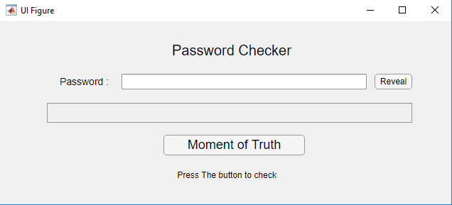
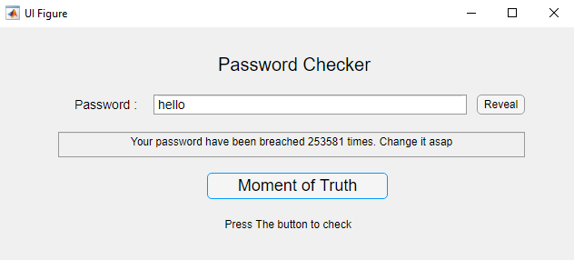
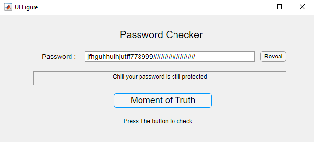

# password_checker
This is an app(Tkiter,matlab app designer) that lets you check wether your password has ever been breached or not. It uses the api from https://haveibeenpwned.com/
but doesn't upload your password to their server or anywhere for that matter but it uses a sha-256 hashing algorithm to encrypt your password first then checks for that hashed data
to find any breach. 

